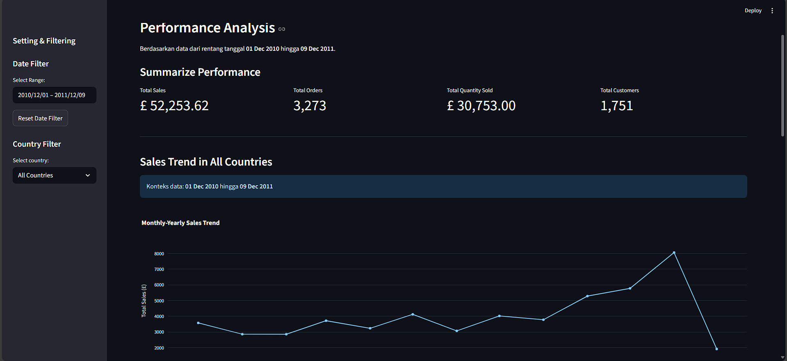

# E-commerce Performance Analysis

This is an interactive dashboard project built with **Streamlit** to analyze and visualize sales performance data from an e-commerce platform. The dashboard allows users to dynamically explore sales trends, analyze customer behavior, and understand order patterns over time.

Link deployment: 

This project is an implementation of the Exploratory Data Analysis (EDA) process, the details of which can be viewed at [this link](https://drive.google.com/file/d/1dAjg_r5oaoYhGH8AvF1IlV11kiory9Kc/view?usp=sharing).

## Dashboard Preview


``

## Key Features

- **Performance Metrics Summary:** Displays key metrics in real-time, such as Total Sales, Total Orders, Total Quantity Sold, and Unique Customers.
- **Dynamic Filtering:** Users can filter the data by:
    - **Date Range:** To select a specific analysis period.
    - **Country:** To analyze sales performance for a specific country or for all countries.
- **Sales Trend Visualization:** A line chart showing monthly sales trends to identify growth or decline over time.
- **Customer Analysis:** Displays the top 10 customers by total sales value and total number of orders to identify the most loyal customers.
- **Order Pattern Analysis:**
    - **Daily Order Distribution:** A donut chart showing the percentage of orders by time of day (morning, afternoon, evening, night).
    - **Hourly Order Trend:** A line chart to visualize the busiest hours for incoming orders.
    - **Order Heatmap:** A heatmap visualization showing order intensity by day and hour, making it easy to identify peak times.
- **Dataset Viewer:** A separate tab to view the filtered raw data, allowing users to inspect the details directly.

## Technologies Used

- **Python**: The primary programming language.
- **Streamlit**: The framework for building the interactive web application.
- **Pandas**: Used for data manipulation and analysis.
- **Plotly**: For creating interactive data visualizations (line chart, pie chart, heatmap).
- **Altair**: For creating declarative data visualizations (bar charts).

## Getting Started

To run this project in your local environment, follow these steps:

### 1. Environment Setup
Ensure you have Python 3.8+ installed on your system.

**Clone the Repository**
```bash
git clone [https://github.com/Ramshall/data_visualization_withStreamlit/tree/main]
```

### 2. Install Dependencies
Install all rquired libraries in the the requirements.txt file
```bash
pip install -r requirements.txt
```

### 3. Running the application
Use the streamlit to trun the app
```bash
streamlit run viz_app.py
```

## Project Structure
```text
.
├── data/
│   └── data_ecommerce_cleaned.csv
├── streamlit_venv/
├── requirements.txt
└── viz_app.py
```
* `data/`: A folder containing the cleaned dataset.
* `streamlit_venv/`: The folder for the virtual environment (optional, depends on your setup).
* `requirements.txt`: A list of all required Python dependencies.
* `viz_app.py`: The main script for the Streamlit application.
